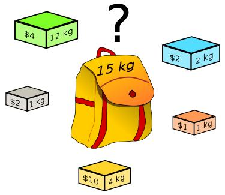

## 背包问题：
背包问题是动态规划非常重要的一类问题，它有很多变种，但题目千变万化都离不开我根据力扣上背包问题的题解总结的解题模板。负责任地说，吃透这一篇文章，力扣上所有背包问题拿过来就可以秒杀！

## 背包定义：
那么什么样的问题可以被称作为背包问题？换言之，我们拿到题目如何透过题目的不同包装形式看到里面背包问题的不变内核呢？
我对背包问题定义的理解：
给定一个背包容量target，再给定一个数组nums(物品)，能否按一定方式选取nums中的元素得到target
注意：
1. 背包容量target和物品nums的类型可能是数，也可能是字符串
2. target可能题目已经给出(显式)，也可能是需要我们从题目的信息中挖掘出来(非显式)(常见的非显式target比如sum/2等)
3. 选取方式有常见的一下几种：每个元素选一次/每个元素选多次/选元素进行排列组合
4. 那么对应的背包问题就是下面我们要讲的背包分类

## 背包问题分类：
常见的背包类型主要有以下几种：
1. 0/1背包问题：每个元素最多选取一次
2. 完全背包问题：每个元素可以重复选择
3. 组合背包问题：背包中的物品要考虑顺序
4. 分组背包问题：不止一个背包，需要遍历每个背包

而每个背包问题要求的也是不同的，按照所求问题分类，又可以分为以下几种：
1. 最值问题：要求最大值/最小值
2. 存在问题：是否存在…………，满足…………
3. 组合问题：求所有满足……的排列组合

因此把背包类型和问题类型结合起来就会出现以下细分的题目类型：
1. 0/1背包最值问题
2. 0/1背包存在问题
3. 0/1背包组合问题
4. 完全背包最值问题
5. 完全背包存在问题
6. 完全背包组合问题
7. 分组背包最值问题
8. 分组背包存在问题
9. 分组背包组合问题
这九类问题我认为几乎可以涵盖力扣上所有的背包问题

> 作者：eh-xing-qing

>[原文链接](https://leetcode.cn/problems/last-stone-weight-ii/solution/yi-pian-wen-zhang-chi-tou-bei-bao-wen-ti-5lfv/
)

>来源：力扣（LeetCode）
