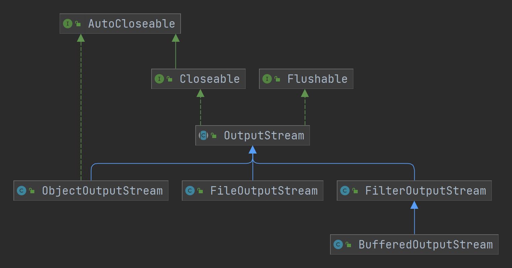

# IO

## File
### 创建文件 (createNewFile)

```java
public static void create1() {
    String path = "E:\\news1.txt";
    File file = new File(path);
    try {
        file.createNewFile();
        System.out.println("create file success!");
    }
    catch (IOException e) {
        throw new RuntimeException(e);
    }
}
```

```java
public static void create2() {
    File file = new File("E:\\");
    String fileName = "news2.txt";
    try {
        // 执行了 createNewFile() 方法才会创建文件
        new File(file, fileName).createNewFile();
        System.out.println("create file success!");
    }
    catch (IOException e) {
        throw new RuntimeException(e);
    }
}
```

```java
public static void create3() {
    String parentPath = "E:\\";
    String fileName = "news3.txt";
    File file = new File(parentPath, fileName);
    try {
        file.createNewFile();
        System.out.println("create file success!");
    }
    catch (IOException e) {
        throw new RuntimeException(e);
    }
}
```

### 文件信息

```java
public static void getFileInfo() {
    
    File file = new File("E:\\news1.txt");
    
    // 获取文件名称：
    String fileName = file.getName();
    System.out.printf("file name: `%s` \n", fileName);
    
    // 获取文件绝对路径
    String absolutePath = file.getAbsolutePath();
    System.out.printf("file absolute path: `%s` \n", absolutePath);
    
    // 获取文件父目录
    String parent = file.getParent();
    System.out.printf("file parent path: `%s` \n", parent);
    
    // 获取文件大小
    long length = file.length();
    System.out.printf("file length: `%d` \n", length);
    
    // 文件是否存在
    boolean exists = file.exists();
    System.out.printf("file exists: `%b` \n", exists);
    
    // 是否是文件
    boolean isFile = file.isFile();
    System.out.printf("file isFile: `%b` \n", isFile);
    
    // 是否是目录
    boolean directory = file.isDirectory();
    System.out.printf("file isDirectory: `%b` \n", directory);
    
}
```
### 文件目录操作

```java
/**
 * <p>判断文件是否存在</p>
 * <p>存在则删除</p>
 */
public static void deleteFile() {
    File file = new File("E:\\news1.txt");
    if (file.exists()) {
        if (file.delete()) {
            System.out.println(file.getName() + " 删除成功!");
        }
        else {
            System.out.println(file.getName() + " 删除失败!");
        }
    }
    else {
        System.out.println("该文件不存在!");
    }
}

/**
 * <p>删除目录</p>
 */
public static void deleteDirectory() {
    File file = new File("E:\\demo01");
    if (file.exists()) {
        if (file.delete()) {
            System.out.println(file.getName() + " 该目录或文件删除成功!");
        }
        else {
            System.out.println(file.getName() + " 该目录或文件删除失败!");
        }
    }
    else {
        System.out.println("该目录或文件不存在!");
    }
}

/**
 * <p>创建多级目录: file.mkdirs()</p>
 * <p>创建一级目录: file.mkdir() </p>
 */
public static void createDirectory() {
    String directoryPath = "D:\\demo\\a\\b\\c";
    File file = new File(directoryPath);
    if (file.exists()) {
        System.out.println(file.getAbsolutePath() + " 该目录存在!");
    }
    else {
        if (file.mkdirs()) {
            System.out.println(file.getAbsolutePath() + " 该目录创建成功!");
        }
        else {
            System.out.println(file.getAbsolutePath() + " 该目录创建失败!");
        }
    }
}
```

## 字节流

### InputStream

### OutputStream



## 字符流

### Reader

### Writer
